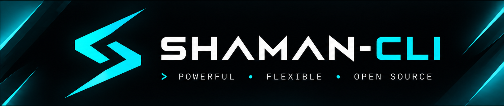

<p align="center"><a href="https://nikolas-chambers.github.io/shaman-cli/"></a></p>

<h2 align="center">~ Your link between worlds ~</h2>

<p align="center"><b><a href="https://nikolas-chambers.github.io/shaman-cli/">nikolas-chambers.github.io/shaman-cli</a></b></p>

**Homepage: <https://nikolas-chambers.github.io/shaman-cli/>**  
**Docs: <https://nikolas-chambers.github.io/shaman-cli/docs.html>**

A coding agent for your terminal, written in C++. Heavily inspired by
[opencode](https://github.com/anomalyco/opencode) and Claude Code, and by what
the community needs from a coding agent: one native binary, no runtime, any model provider.

```sh
shaman                               # full-screen UI
shaman run "why is the build failing?"
git diff | shaman run "review this"
shaman web                           # browser UI
```

## Platforms

| Platform | How |
|---|---|
| Linux x64 | release zip (CLI + desktop app), or build from source |
| Linux arm64 | release zip, or build from source (`cmake/aarch64-linux-gnu.cmake` cross-compiles) |
| macOS (Apple silicon, Intel) | release zip (CLI + `Shaman.app`), or build from source with Homebrew |
| Windows 10/11 x64 | release zip (`shaman.exe` + `shaman-desktop.exe`, WebView2), or build with MSVC |
| Android (Termux, aarch64) | release zip (`pkg install libcurl openssl`), or `bash scripts/termux-install.sh` |
| Android app | coming soon |
| Any browser | `shaman web`, on the same machine or over your network with `--host` and `--token` |

## Install

```sh
curl -fsSL https://raw.githubusercontent.com/nikolas-chambers/shaman-cli/main/scripts/install.sh | sh   # Linux, macOS, Termux
```
```powershell
irm https://raw.githubusercontent.com/nikolas-chambers/shaman-cli/main/scripts/install.ps1 | iex        # Windows
```

Or download a release zip (CLI, desktop app, `shaman.ini.example`), Homebrew and Scoop manifests come with each
release (`packaging/`). To build: CMake 3.24+, a C++23 compiler (GCC 13, Clang 17, MSVC 19.38), libcurl and
OpenSSL.

```sh
# Debian/Ubuntu: apt install cmake ninja-build libcurl4-openssl-dev libssl-dev nlohmann-json3-dev
# macOS:         brew install cmake ninja curl openssl nlohmann-json
cmake -S . -B build -G Ninja -DCMAKE_BUILD_TYPE=Release
cmake --build build && sudo cmake --install build
```

Cross-compile for Windows from Linux with `-DCMAKE_TOOLCHAIN_FILE=cmake/mingw-w64.cmake` (see that file).
`-DSHAMAN_BUILD_DESKTOP=ON` adds the desktop app (`shaman-desktop`; on macOS a `Shaman.app` bundle that
`cmake --install` puts in /Applications). Opened without a folder, the desktop app reopens your last project. The
macOS app is not notarised yet: the first time, right-click it and choose Open (or run
`xattr -dr com.apple.quarantine Shaman.app`). `scripts/package.sh` makes a release zip locally; tagging `v*` makes
all of them in CI.

**Android:** in [Termux](https://termux.dev), clone the repo and run `bash scripts/termux-install.sh`. Everything
works as on Linux, including `shaman web` for a browser UI on the phone; `pkg install termux-api` adds notifications,
clipboard and links. The OS sandbox is not available there. A native Android chat app is coming soon.

**Portable:** put `shaman.ini` (copy [`shaman.ini.example`](shaman.ini.example)) next to the binary, add a key, and
shaman keeps everything in `config/`, `data/` and `cache/` beside it; nothing goes in your home directory. Without it,
shaman uses the usual per-user folders. `shaman upgrade` replaces only the binary. `shaman debug paths` shows where
things live.

## Models

**Free with your GitHub account:** GitHub Models works through your `gh` login (or a token with the Models
permission, or `GITHUB_TOKEN` in Actions), so if you use the GitHub CLI shaman runs with no key at all. The
`/shaman` GitHub Action uses it by default.

`shaman auth login <provider>` or an environment variable: OpenCode Zen (`OPENCODE_API_KEY`), Anthropic, OpenAI,
Google Gemini, OpenRouter, xAI, DeepSeek, Groq, Mistral, Together, Fireworks, Cerebras, DeepInfra, Perplexity,
Moonshot, Z.ai, NVIDIA, Hugging Face, SambaNova, GitHub Models, plus Azure OpenAI, Vertex AI and Bedrock from their environment, and
Ollama or LM Studio locally with no key. Any OpenAI-compatible, OpenAI Responses or Anthropic-style endpoint can be
added in config. With no model chosen, shaman picks one from the providers you set up, preferring no-cost models
(such as [OpenCode Zen](https://opencode.ai/zen)'s Big Pickle), and moves on when one is rate limited.

Per model you can set reasoning effort, temperature, extra request fields, which tools it gets and how much context
it uses (for small or cheap models); `/effort low|medium|high|off` changes thinking live. Thinking is kept across tool
calls where the API needs it. See [docs/CONFIG.md](docs/CONFIG.md#providers-and-models).

## Use

| | |
|---|---|
| `shaman [message]` | Full-screen UI. `Ctrl-P` commands, `Shift-Tab` permission mode, `Esc` stop |
| `shaman run [message]` | One-shot. `-f` attaches files/images, `@path` inlines files, `--format json` |
| `shaman serve` / `web` | HTTP API and web UI ([docs/SERVER.md](docs/SERVER.md)); `shaman-desktop` is the same UI in a window; `--pair` shows a QR code to open it on your phone |
| `shaman acp` | Agent Client Protocol, for Zed and other editors |
| VS Code | the Shaman extension ([editors/vscode](editors/vscode)): chat in the sidebar, send a selection or file |
| `shaman mcp list\|auth\|serve` | MCP servers (stdio, HTTP, OAuth); `serve` exposes shaman's tools over MCP |
| `shaman github install` | `/shaman` comments on issues and PRs via GitHub Actions |
| `shaman export\|import\|share\|stats\|fork` | Sessions as Markdown, JSON or a shareable HTML page |
| `shaman worktree <name>` | Work in an isolated git worktree on its own branch |
| `shaman schedule add "<cron>" <prompt>` | Recurring runs via cron |
| `shaman doctor` | Check keys, network, tools, language servers, sandbox and platform |
| `shaman completion bash\|zsh\|fish`, `upgrade` | Shell completions; self-update |

**In a session:** `/goal <objective>` keeps working until the goal is verified; `/revert` goes back to any earlier
message with files restored; `/fork` branches the conversation; `/context` shows where the context window goes;
`/effort`, `/mode`, `/theme`, `/undo`, `/compact`, `/copy [code]`, `/paste` (clipboard image, also Ctrl-V),
`/export`, `/share`, custom commands and MCP prompts (`/server:prompt`). `!command` runs a shell command and sends its
output with your next message; `# note` saves to project memory. Edits show a coloured diff.

**Safety:** edits and commands ask first. `Shift-Tab` cycles ask-first, accept edits and plan mode (read-only; it
ends by asking you to approve the plan, then builds). `"sandbox": true` runs shell commands so they can only write
inside the project (bubblewrap on Linux, sandbox-exec on macOS). Hooks run your own scripts before and after tools, on
each prompt and when the agent stops, and can block. Keys from `shaman auth login` go into the macOS Keychain,
Windows Credential Manager or the Linux Secret Service (typed input is hidden; `shaman auth secure` moves older keys
there). Secrets are redacted from tool output, a loop guard stops runaway repeats, and undo never touches your git
history.

**Look and feel:** themes for the terminal and the web/desktop UI (dark, light, Halloween, Dracula, Nord, Gruvbox,
Solarized, Monokai and more), custom colours, keybinds, a statusline command and mouse-wheel scrolling. The web UI
runs several sessions at once (the sidebar shows which are working or done), and has inline diffs, revert and fork on
any message, drag-drop and paste of files and images, a `/` command menu, the
agent's plan, session search, mode and effort menus, context and cost meters, and export.

**Agents and skills:** `build` (default), `plan` (read-only), subagents `explore` and `general`, and your own in
`.shaman/agents/*.md`. 35 built-in skills load when relevant: engineering (code review, debugging, testing,
refactoring, performance, security review, git, API design, migrations, dependency upgrades, onboarding),
infrastructure (CI/CD, Docker, Kubernetes, Terraform, observability, incidents, releases), web (frontend,
accessibility, testing, scraping), data and AI (SQL, data analysis, LLM apps, MCP servers), writing, shell scripting,
skill creation, and PDF, Word, Excel and PowerPoint documents with tested scripts.

**Codebase index:** the `symbols` tool finds where things are defined, outlines files and maps the repository across
25 languages, from an index that updates incrementally (`shaman debug index <name>` to try it).

**Tools (28):** `read` (images and notebooks too), `write`, `edit`, `multiedit`, `apply_patch`, `notebook_edit`,
`list`, `glob`, `grep`, `batch`, `bash` (with background jobs, `bash_output`, `bash_input`, `bash_kill`), `http`,
`webfetch`, `websearch`, `lsp`, `task` and `task_output` (subagents, also in the background), `todowrite`,
`todoread`, `question`, `memory`, `skill`, `symbols`, `plan_exit`, `mcp_resources`, plus MCP and plugin tools. After each edit
shaman runs the project's formatter and reports language-server errors.

## Config

`shaman.json` in the project or the config folder, or `shaman.ini` in portable mode. Reference:
[docs/CONFIG.md](docs/CONFIG.md).

```jsonc
{
  "model": "anthropic/claude-sonnet-5",
  "mode": "acceptEdits",
  "permission": { "bash": { "*": "ask", "npm test*": "allow", "git push*": "deny" } },
  "sandbox": true,
  "hooks": { "PostToolUse": [{ "matcher": "edit|write", "command": "npx prettier -w \"$SHAMAN_FILE\"" }] },
  "tui": { "theme": "halloween" },
  "mcp": { "docs": { "url": "https://example.com/mcp" } }
}
```

## Debugging

```sh
shaman --debug=provider,tool run "..."   # categories: config provider http sse tool permission session agent mcp
shaman --trace run.jsonl run "..."       # every request, stream chunk, tool call, hook and permission decision
shaman debug prompt                      # the exact system prompt; also config paths models agents tools lsp ...
```

## Extending

Plugins are programs in any language that hook tool calls, permissions, prompts and events, and add tools. SDKs for
[Python](sdk/python) and [TypeScript](sdk/typescript); see [docs/PLUGINS.md](docs/PLUGINS.md). The same folders have
clients for the HTTP API.

## Improvements over opencode

Native binary with millisecond startup · portable mode · safer defaults (read-before-edit, loop guard, secrets
redacted, OS sandbox, hooks) · plan approval and permission modes · reasoning effort and context budgets per model ·
revert and fork on any message · fallback between no-cost models · context pruning before compaction · background
subagents and shell jobs · `/goal` · worktrees · scheduling · crash-safe append-only sessions · undo outside your git
history · formatters only where configured · commands never hang on a prompt · plugins in any language · `doctor` ·
debug logs and JSONL traces · Termux · an offline test suite against mock model, MCP and LSP servers, plus a live suite.
Most of this replaces popular opencode plugins with built-ins.

## Status

Tested on Linux: 36 unit tests, 110 offline end-to-end checks, and a live suite (`tests/e2e/live.sh`, 20 checks
including permission-bypass attempts) passing on Gemini 2.5 Flash, plus the web UI in Chromium, the terminal UI in
xterm and the desktop app under X11. Windows: a MinGW cross-build passes all unit tests and a Windows process-layer
suite under Wine, and runs real agent turns (files, shell, background jobs); CI repeats this on every push. macOS,
native Windows and Termux are not yet verified on real machines.

## Development

```sh
ctest --test-dir build --output-on-failure      # unit + end-to-end (mock servers in tests/mock/)
SHAMAN_LIVE_MODEL=google/gemini-2.5-flash tests/e2e/live.sh   # against a real model (needs its key)
```

Architecture: [docs/ARCHITECTURE.md](docs/ARCHITECTURE.md). The website lives in `docs/` (GitHub Pages: Settings →
Pages → deploy from branch `main`, folder `/docs`). License: MIT.

---

QR codes by [Project Nayuki's QR Code generator](https://www.nayuki.io/page/qr-code-generator-library) (MIT,
`third_party/qrcodegen`). Inspired by [opencode](https://github.com/anomalyco/opencode) (MIT). Big Pickle and other models via [OpenCode Zen](https://opencode.ai/zen).
Not affiliated with opencode.

---

<table>
<tr><td>

### 💼 For hire

AI, learning, app, and web development. Frontend, back end, and servers. For
Windows, Linux, and Android. In Java, C, C++, Python, Go, asm, and more — UI,
GUI and command line. I like working with cutting-edge technology and turning
it into something useful for the community, not just another demo. Need an
agent, a CLI, a developer tool, or just about anything else? I can probably put
the pieces together — [email me](mailto:nikolasjonchambers@gmail.com) —
I'm open to freelance work.

### ☕ Buy me a coffee?

**Venmo · Cash App · PayPal — "NikAndRigatoni" (Nikolas Chambers)**

The honest version: my dog and I are living in the car right now. I spend my
days writing code anyway - bringing old projects of mine back to life one at a
time, and learning everything I can along the way. If anything here was useful
to you, a few bucks goes to dog food, gas, and keeping the laptop running, and
it buys me more hours to keep building. Either way, thanks for reading this far.

</td></tr>
</table>
